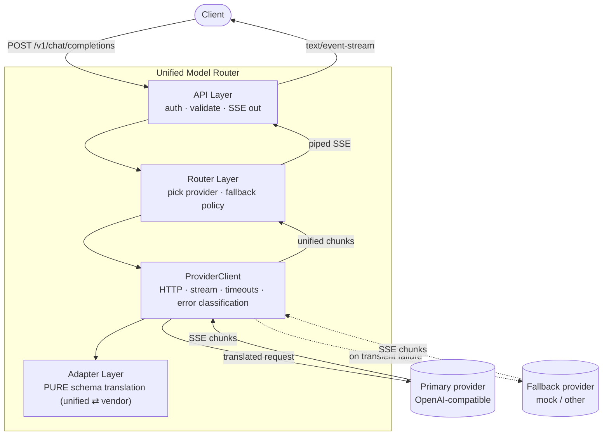
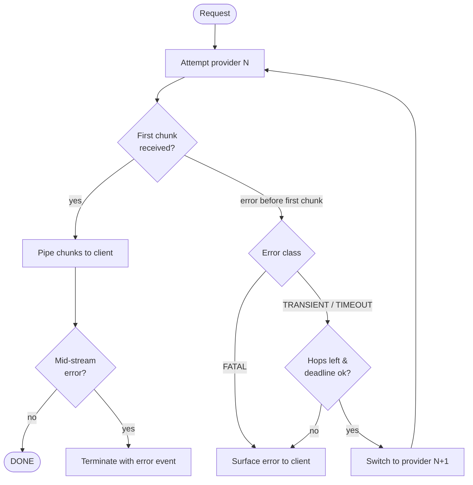
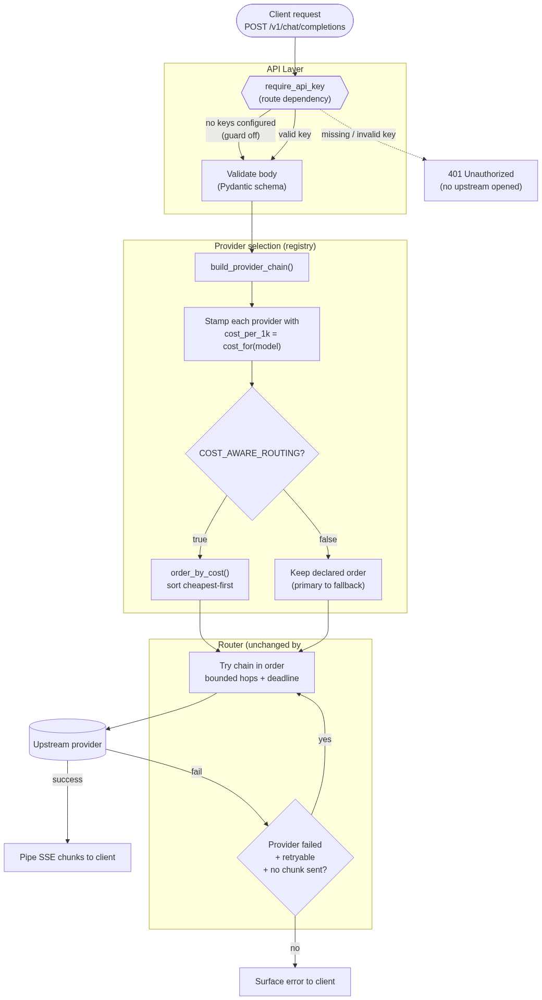

# Design — Unified Model Router

This document captures the design for a production-ready API gateway that acts as a unified model router (OpenRouter-style). It covers the problem statement, architecture, the unified schema, the fallback policy, and stream/connection management.

---

## 1. Problem statement (plain English)

### The core idea: a "universal translator + traffic cop" for LLMs

Apps that use AI often want to talk to multiple providers (OpenAI, Anthropic, Groq, ...). The problem is that **every provider speaks a slightly different language**:

- OpenAI wants the system prompt *inside* the `messages` array.
- Anthropic wants the system prompt as a *separate* top-level field, and structures content as "blocks."
- Streaming formats, error codes, and URLs all differ.

Hardcoding to one provider means switching requires rewriting code — and if that provider goes down, the app goes down.

A **unified model router** sits between the app and all providers:

```
Your App  ─────►  [ Unified Router ]  ─────►  OpenAI
 (speaks ONE                            ├───►  Mock / other
  language)                             └───►  Groq / ...
```

The app always speaks **one language** (a unified schema). The router translates to whichever provider it picks, and if one fails, it silently tries another — the app never notices. This is a mini version of what OpenRouter does commercially.

### The three core jobs

**Job 1 — Unified API & schema translation.** Accept one standard request at `POST /v1/chat/completions`, then translate it to whatever the chosen provider expects.

Example standard request:

```json
{
  "model": "gpt-4o-mini",
  "messages": [{"role": "user", "content": "Hello!"}],
  "stream": true
}
```

The router inspects `model`, decides the target provider, translates if needed, and forwards it.

**Job 2 — Streaming proxy (SSE).** LLMs generate text token by token. The response streams back via **Server-Sent Events (SSE)** (the "typewriter" effect). The router must **pipe** each chunk straight through as it arrives — a **water pipe, not a bucket**. Buffering the whole response wastes memory and kills the streaming feel.

Example stream the client receives:

```
data: {"choices":[{"delta":{"content":"Hel"}}]}
data: {"choices":[{"delta":{"content":"lo"}}]}
data: {"choices":[{"delta":{"content":"!"}}]}
data: [DONE]
```

**Job 3 — Resilient fallback routing.** If the primary provider fails with a *transient* error (429 rate limit, 502/503 down), the router **silently switches to a backup** and streams from there. The client never sees the error — they just get their answer, slightly later.

```
Client → Router → OpenAI  ❌ 429 Too Many Requests
                     ↓ (silent switch)
                  Backup   ✅ streams the answer
Client ← receives a normal streaming response, none the wiser
```

### The subtle part: the "point of no return"

The tricky question is **when it is too late to fall back**:

- Provider fails *before* sending any text → easy, switch to backup.
- Provider fails *after* already sending "Hel" → cannot switch; the client already has half an answer from a different model, and switching would produce gibberish.

So fallback has a **point of no return**: the moment the first chunk reaches the client. The design addresses this explicitly (see §5).

### What "production-ready" adds

- **Client hang-ups** — if the user disconnects mid-answer, stop and close the upstream connection (don't keep burning tokens).
- **Timeouts** — a hung provider must not hang the client forever.
- **Tests, CI/CD, docs, and an architecture diagram.**

---

## 2. Architecture

### Guiding principle: separation of concerns

Each layer does exactly one job and knows nothing about the others' internals. This makes the system testable and extensible, and directly satisfies the rubric ("separates routing logic from vendor payload variations via the Adapter pattern").



### The four layers

**Layer 1 — API Layer.** The HTTP front door: `POST /v1/chat/completions`, `/health`, `/ready`. Validates the incoming request, checks the gateway API key (auth guard), and returns the `StreamingResponse`.
*Why separate:* the web/HTTP concern shouldn't leak into routing logic; it's where we reject bad requests *before* opening any expensive upstream connection.

**Layer 2 — Router Layer.** The brain: decides **which** provider(s) to try and in what order, then orchestrates the **fallback policy** (bounded hops, deadlines, which errors trigger a switch).
*Why separate:* pure decision-making, isolated from HTTP and vendor JSON, so fallback logic can be tested on its own.

**Layer 3 — ProviderClient (transport).** Owns everything about *talking* to an upstream: the shared httpx client, opening the streaming connection, timeouts, and **classifying errors** into a taxonomy (transient / fatal / timeout).
*Why separate:* networking is messy and stateful; quarantining it keeps the Router clean and holds the **shared connection pool** (created once at startup, reused for throughput).

**Layer 4 — Adapter (pure translation).** Pure functions converting **unified → vendor** request and **vendor chunk → unified** chunk. No network, no state.
*Why separate and pure:* this is the **Adapter pattern** centerpiece. Pure functions (JSON in → JSON out) are unit-testable with **zero mocking**. Adding a provider = one new adapter, touching nothing else.

### The senior insight in the structure

We split **Adapter** (translation) from **ProviderClient** (transport). A naive design merges them ("the OpenAI adapter also makes the HTTP call"). Keeping them apart means translation is pure/mock-free to test, and transport is tested once and reused by all providers. That separation is the difference between *using* the Adapter pattern and *understanding why* it exists.

### What we're adding, and why

| Component | Why it's there | Rubric requirement |
|---|---|---|
| Unified Pydantic schema | One language for clients | Unified API & schema translation |
| Adapter layer (pure) | Vendor translation, isolated | Adapter pattern / schema translation |
| ProviderClient + shared pool | Clean transport, throughput | Streaming, connection management |
| Router + fallback policy | Silent resilience | Resilient fallback routing |
| SSE `StreamingResponse` piping | Real streaming, low memory | Streaming proxy (SSE) |
| Cancellation-based disconnect handling | No leaks on hang-up | Stream & Connection Management |
| Error taxonomy (enum) | Decide what is retryable | Resilient fallback |
| Auth guard *(extension)* | Reject bad traffic early | API Authorization Guard |
| Cost manifest *(extension)* | Cheapest-first routing | Cost-Aware Routing |

---

## 3. Unified schema

The unified schema mirrors the OpenAI `chat/completions` shape (the de-facto standard for maximum client compatibility).

### Request

| Field | Type | Required | Notes |
|---|---|---|---|
| `model` | string | yes | Logical model name; mapped to a provider via the registry |
| `messages` | array | yes | `{role, content}` items; roles: `system` / `user` / `assistant` |
| `stream` | bool | no (default `false`) | When `true`, respond via SSE |
| `temperature` | number | no | Sampling temperature |
| `max_tokens` | int | no | Upper bound on generated tokens |
| `metadata` | object | no | Passthrough; may carry a client request id |

Inbound `X-Request-ID` header is honored if present; otherwise the gateway generates one and echoes it back for traceability.

### Unified streaming chunk (what the client always receives)

Regardless of which vendor served the response, the client receives OpenAI-style SSE chunks:

```
data: {"id":"...","object":"chat.completion.chunk","choices":[{"delta":{"content":"Hel"},"index":0,"finish_reason":null}]}
data: {"id":"...","object":"chat.completion.chunk","choices":[{"delta":{"content":"lo"},"index":0,"finish_reason":null}]}
data: {"id":"...","object":"chat.completion.chunk","choices":[{"delta":{},"index":0,"finish_reason":"stop"}]}
data: [DONE]
```

- `Content-Type: text/event-stream`
- Each event is a `data: ` line followed by a blank line.
- Terminates with the `data: [DONE]` sentinel.

### Non-streaming response

When `stream=false`, a single unified JSON body is returned with `choices[].message.content`.

### Reasoning models

Reasoning models (e.g. `gpt-oss`, o-series) stream a separate `reasoning_content`
field in the delta (with `content == null`) for their "thinking", followed by the
user-facing `content`. The unified `Delta` preserves `reasoning_content` so clients
can render reasoning if desired; clients that read only `content` are unaffected.
Some providers also emit a trailing usage-only chunk with an empty `choices` array,
which carries no client-visible delta and is skipped. Both behaviors were found and
handled via live testing against DigitalOcean Serverless Inference (`gpt-oss-120b`).

---

## 4. Error taxonomy

Errors are classified into an enum that drives routing decisions:

| Class | Examples | Triggers fallback? |
|---|---|---|
| `TRANSIENT` | 429, 502, 503, connection reset | Yes |
| `TIMEOUT` | connect timeout, read timeout | Yes |
| `FATAL` | 400, 401, 403, 404, malformed request/response | No — surface to client |

Only `TRANSIENT` and `TIMEOUT` cause a provider switch. `FATAL` errors are surfaced immediately (retrying would not help and could mask a real client bug).

---

## 5. Fallback policy

### Point of no return

Fallback is only safe **before the first chunk is flushed to the client**. Once a chunk has been sent, switching providers would corrupt the response, so a mid-stream failure after the first byte terminates the stream with an error event instead of switching.

Three failure windows:

1. **Pre-connection / immediate transient error** → safe to fall back transparently.
2. **After headers, before first token** → still safe to fall back (nothing user-visible yet).
3. **Mid-stream, after tokens sent** → cannot silently switch; terminate with an error event.

### Commit window (senior differentiator)

Optionally hold the first chunk(s) for a short window (a few hundred ms) before flushing to the client. This keeps early upstream failures recoverable at the cost of a small increase in time-to-first-token. The simple implementation flushes immediately (point-of-no-return at first chunk); the commit-window variant is documented as the more resilient option.

### Bounds (no retry storms)

- **Bounded fallback depth** — max hops (default 2) so one outage can't cause an amplification storm.
- **Per-attempt timeout** and an **overall request deadline** so total latency is capped.
- **Honor `Retry-After`** on 429 rather than blindly retrying.
- Immediate switch when moving to a *different* provider; jittered backoff only when retrying the *same* one.



---

## 6. Stream & connection management

**True streaming (no buffering).** Responses are piped chunk-by-chunk using an async generator over the upstream stream, yielded into FastAPI's `StreamingResponse`. The full upstream body is never read into memory (`aread()` is avoided) — this satisfies the "without buffering the full execution payload in memory" requirement.

**Client disconnection mid-generation.** Handled via `asyncio.CancelledError` propagation rather than polling `is_disconnected()`. When the client drops, the cancellation propagates into the streaming generator; a `try/finally` guarantees the upstream httpx stream (and its socket) is closed, preventing socket/token leaks and stopping token spend immediately.

**Target connection timeouts.** The `ProviderClient` sets separate **connect** and **read** timeouts. A connect timeout is treated as `TIMEOUT` and triggers fallback; a read timeout mid-stream (after first chunk) terminates the stream cleanly.

**Connection pooling.** A single shared `httpx.AsyncClient` with a tuned pool is created in the FastAPI lifespan and reused across requests — never one client per request — to avoid TCP/TLS handshake churn and maximize throughput.

**Graceful shutdown.** On shutdown, in-flight streams are drained and the shared client is closed in the lifespan teardown.

---

## 7. Observability

- A **request id** (inbound `X-Request-ID` or generated) is attached to every request and echoed back.
- **Structured (JSON) logs** record the request id and the full provider-attempt chain, so a fallback sequence ("primary 429 → switched to backup → success") is fully traceable.

---

## 8. Extensions (implemented)

Both "Extensions & Next Steps" items are implemented and tested; each is opt-in
so the core behavior is unchanged when disabled.

- **API Authorization Guard** (`app/api/auth.py`) — a FastAPI dependency
  (`require_api_key`) validates the caller's key (`Authorization: Bearer <key>` or
  `X-API-Key`) against `GATEWAY_API_KEYS` and rejects invalid/missing keys with
  **401 before any upstream connection is initialized**. Empty config disables the
  guard (local/dev). Runs as a route `dependency`, so it executes ahead of routing.
- **Cost-aware routing** (`app/models/manifest.py` + `build_provider_chain`) — a
  per-model cost manifest (USD per 1K tokens) orders the provider chain
  cheapest-responsive-first when `COST_AWARE_ROUTING=true`, before defaulting to
  pricier fallbacks. Implemented at the chain-building seam, so the Router is
  unchanged. Unknown models use a neutral default cost.

### Request flow through both extensions

Both extensions plug into existing seams at the *edges* of the pipeline — the auth
guard at the entrance (a route dependency that runs before any upstream socket),
and cost-aware routing at the selection seam (reordering the chain before the
Router consumes it). The core Router in the middle is unchanged, and both
extensions are opt-in (default-off), so the happy path with them disabled is
identical to the original core behavior.

Note that "cheapest **responsive** first" is not a single function: it is the
cost-sort (extension) plus the Router's existing fallback loop. If the cheapest
provider fails a retryable error before any chunk is sent, the loop advances to
the next-cheapest automatically.



*(Diagram source: [`docs/extensions-flow.mmd`](docs/extensions-flow.mmd).)*

---

## 9. Deployment notes

- **Container:** `Dockerfile` builds a `python:3.14-slim` image, runs as a non-root
  user (`appuser`), exposes port 8000, and defines a `HEALTHCHECK` on `/health`.
  CI runs the test suite on push.
- **Build — verified.** The image builds successfully (all 12 steps: dependency
  install, code copy, non-root user, ~206 MB image). In the development sandbox the
  standard Docker/BuildKit builder is blocked (nested-container `mount`/`unshare`
  restrictions), so the build was performed with `buildah --isolation chroot`,
  which uses chroot instead of namespace isolation for `RUN` steps. On a normal
  Docker host, `docker build -t unified-model-router .` works directly.
- **Run — environment-limited *in the sandbox*, but proven in production.**
  Starting the built container could not be exercised in the dev sandbox itself:
  every OCI runtime (runc/crun/docker/podman) must mount `/proc` into the container
  namespace to start the process, and that syscall is denied here (`mount proc to
  proc: operation not permitted`). This is a sandbox restriction, not an image
  defect.
- **Live deployment — verified.** The service is deployed on **DigitalOcean App
  Platform**, built from this repo's `Dockerfile`, and confirmed working
  end-to-end: `/health` and `/ready` return OK, and a streaming
  `POST /v1/chat/completions` returns real unified SSE chunks (incl.
  `reasoning_content`) and `[DONE]` from `gpt-oss-120b`. The custom `X-Request-ID`
  is echoed back. Spec: `.do/app.yaml`; `deploy_on_push` redeploys on each push to
  `main`.
